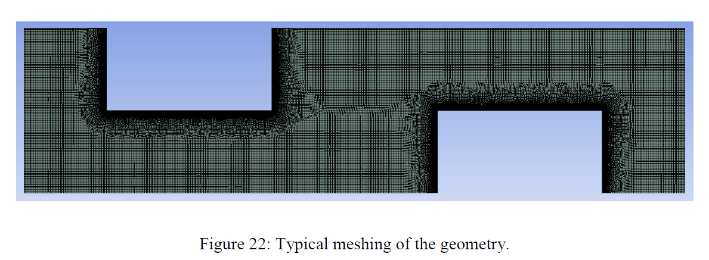
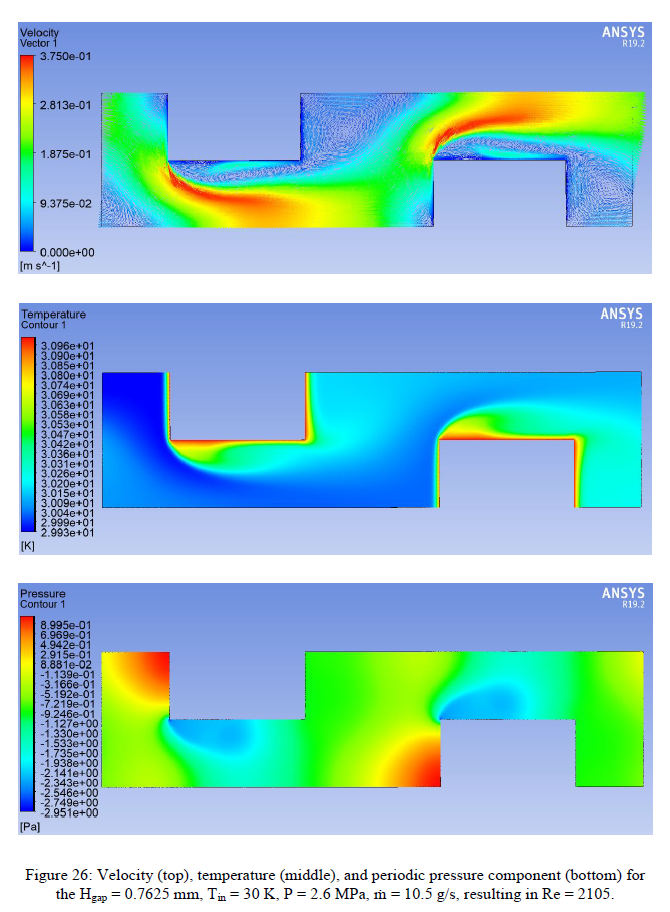

OFtankentai
===========

## :herb:Openfoam探险队教程中文翻译

>OpenFOAM 探险队(原名 OpenFOAM たんけんたい)是由一名日本OpenFOAM资深用户在其博客发表的OpenFOAM源代码探索系列教程。
>
>原作可以在[这里](http://www.geocities.jp/penguinitis2002/study/OpenFOAM/tankentai/)找到。
>
>原作:Yuu Kasuga (penguinitis2002@yahoo.co.jp)
>
>翻译:houkensjtu (houkensjtu@gmail.com)

作者序:

为了潜入 OpenFOAM 源代码茂密的丛林深处,我们组织了这支探险队。以下是活动报告。

[第一期 最小OpenFOAM程序](./articles/第1期最小OpenFOAM程序.md)  
[第二期 参数列表](./articles/第2期参数列表.md)  
[第三期 时间类](./articles/第3期时间类.md)  

## :palm_tree:番外篇：ハードボイルドの森

(以下内容为翻译者原创)

村上ハルヒ「ただのノーベル文学賞には興味ありません！」  
ながもん「情報四面体によって造られた対有機化合物コンパクト用ヒューマンインターネットフェイス、それが、私」  
正直言おう・・・、俺はこいつらが何を言ってるのかさっぱりわからなかった。  

[Case1 : Laminar flow in a 2D axis-symmetric channel](./validations/Axis_Hagen/readme.md)   
[Case2 : Intro to Turbulent flow](./validations/Axis_Turb/readme.md)

## :seedling:裏番組：Evan P. Sheehan的PhD论文

### 1. Introduction
- 对流式换热器在低温系统中被广泛应用（Recuperative heat exchangers，不同于回热式换热器regenerative heat exchangers）。提高换热器性能可以降低低温端
温度，或者减少系统所需要的制冷量。
### 2. Specification
- 换热器设计的要求如下，最重要的是效率超过99%（可是效率的定义是？）

### 3. Literature review

#### 3.1. The Importance of High Cryogenic Heat Exchanger Effectiveness
- 由于低温制冷机的制冷量往往非常有限，而热交换器承受的热交换量则相对庞大，交换器效率的损失对冷端的负荷的影响往往非常巨大。
- 在下图的模型中，如果热交换器效率为100%，则正好从换热器流出和流入的enthalpy一致，**系统所需制冷量=磁体的漏热。**

- 如果热交换器效率小于1，**非效率分就会成为制冷系统的负荷**
- 例子的系统中，热交换器效率约为90%，剩下的部分就成为额外负荷（约67W），加上磁体本身的发热和漏热90W，共需要制冷量157W。可以看到非效率
  增加了很大一部分制冷负荷。

#### 3.2. Typical Compact Heat Exchanger Designs
##### 3.2.1. Parallel Plates: Inline Strip-Fins
- 理论上这种形式的换热器单位体积的换热面积最大，但是实际由于流量存在分布不均，所以效率往往停止在99%以下。
- Marquardt and Radebaugh的研究论文表示，要实现99%以上的效率，流量分布不均必须在2%以下。

##### 3.2.2. Parallel Plates: Offset Strip-Fins
- 与上面的形式基本相同，只是翅片不再是一长条到底，而是相互错开的形状，可以解决部分流量不均匀问题（因为流路之间都是互相通的），也可以破坏边界层促进热交换。
- 与上面的形式相同的是，轴向热传导都会造成一定的损失。

##### 3.2.3. Stacked Staggered Perforated Plates

- 进一步拓展上面的概念到这种交错plate结构的热交换器。plate的开口是互相错开的所以类似于3.2.2的形状，且plate之间有spacer隔开。
- plate本身由高导热的材料做成，促使warm-cold流动之间的热交换，而spcaer是由低导热材料制成，防止热在轴方向传递。
- 在提出这个结构的原论文中，作者仅仅得到了78%的效率，比设计效率还低10%，作者归纳了如下的原因：
  - plate结合不够紧密，导致冷热流间有helium泄漏
  - **寄生热负荷**：指的是热交换器虽然一般置于dewar之中，但是即便如此还是会有真空不够高，从外界泄漏进来热辐射的现象
  - 实验时helium纯度遭到污染，会导致杂质冻结阻塞流路
- 鉴于这个结构高度紧凑且容易实现高效率，本论文决定针对这个模型进行优化。计划采用铜作为plate，316钢作为spacer材料。

- 关于slot做成圆的的还是方的讨论：
  - 比较在同样的外形尺寸条件下，是长方形的通道更有利于传热还是圆形孔更利于传热
  - 比较的方法是假设同样的对流换热系数，比较单位长度的通道所具有的换热面积；其中将通道高度D除以宽度W作为参数

  

  - 从上图看到，当通道变得无限细长的时候，圆形通道的换热面积将是方形的约pi/2也就是1.6倍左右（忽略两端的情况）
  - 但是从制造工艺角度考虑，制造maker建议圆形通道之间的间距必须不小于板的厚度，这使得能够加工的通道个数受限。
  - 考虑了圆形通道的间距后，两者的换热面积关系变成下图。基本上方形通道将具有更大面积，同时考虑到方形易于加工，
  所以本项目就此决定采用方形通道。
    

#### 3.2.3.2. Stacked Plate Heat Exchanger Modeling
- 这里突然转而讨论起了热交换器中的fin换热效率，没有具体说明fin和本换热器设计的关系; 猜测是因为，通过计算fin效率，可以近似计算换热量，从而计算换热器效率
- 一般传热学中，fin的效率定义是实际换热量/当fin的温度都是根部温度时的换换热量，这里的定义也是类似的
- 在计算fin效率时，一般会采用一个参数mL，这个参数mL的定义可以参照各种资料，下图是在网上找到的一个例子

- 在论文中还提到，计算这个fin效率有两种方法，一种是假设流体的温度都是均匀恒定的，但是实际情况中，当热交换发展起来，流体在冷热流方向就有温度差，温度是不均匀。已经有文献研究了修正以后的计算公式，效率比原来的结果稍微低一些。

#### 3.3 3.3. Stacked Plate Heat Exchanger Modeling

### 4. Application of the Numerical Model to the SHI Heat Exchanger

### 5. Fluent model

- 前述的Matlab代码中的Nu以及摩擦系数需要从Fluent模拟中获取。整个模拟包含很多design point，各有不同的设定，以下描述各个部分的设定内容。

#### 5.1 Geometry
- 换热器的三维模型如下，由于fin方向比较长，为了减少计算负荷故忽略此方向而简化为2维计算。

- 4个重要参数：fin height, gap height, fin thickness, and spacer thickness的定义如图所示。为进一步简化模型，仅仅取出红线中的一个cell进行计算。
红线的左右为periodic边界，保证出口与入口的velocity profile一致；另外上下设置为对称边界。

#### 5.2 Meshing

- 采用方形网格，在入口处大约划分了100格（目测）；边界层的网格大小为计算容积中的1/5大。整个计算领域的网格约有44000格子。

#### 5.3 Fluent Setup / Solution Methods
- 入口与出口处施加了periodic条件，强制迫使出入口的速度profile一致；另外periodic条件需要输入一个mass flow rate作为条件，是在Fluent里设置的。
- 为了覆盖所有的设计条件，Evan设置很多mass flow rate，都在前述的design table里**（可是design table在哪里？）**
- 入出口的温度条件与速度类似，只是需要设置一个温度差来保证能量守恒**（这是手动输入还是自动计算？）**
- 湍流采用一方程的Spalart-Allmaras model，理由如下：
  - Spalart-Allmaras model是为内部流动设计，与本模型吻合
  - 本模型由于有periodic条件导致计算容易发散，而Spalart-Allmaras model计算较为稳定，只需求解一个附加变量turbulent viscosity nuTilda
  - Fluent中的Spalart-Allmaras model自动施加壁面函数，因此可以在较为粗糙的网格条件下进行计算。本实验由于计算资源有限，此特性非常具有实际意义。
  - Spalart-Allmaras model的参数都是default。**（可是default设置是什么设置？） **
 - 一般一个case的计算在1000次迭代以内结束，时间花费1-5分钟。
 
 
 
#### 5.4 CFD-Post Flow Visualization and Derived Quantities
- 一个演示例子：入口宽度0.7625mm，helium温度30K,2.6MPa；翅片温度31K
- 结果如图所示，最高流速0.37m/s，Re数2105，对应的质量流量（整个热交换器）为10.5g/s

 
 
 
#### 5.5 Mesh Sensitivity Analysis
