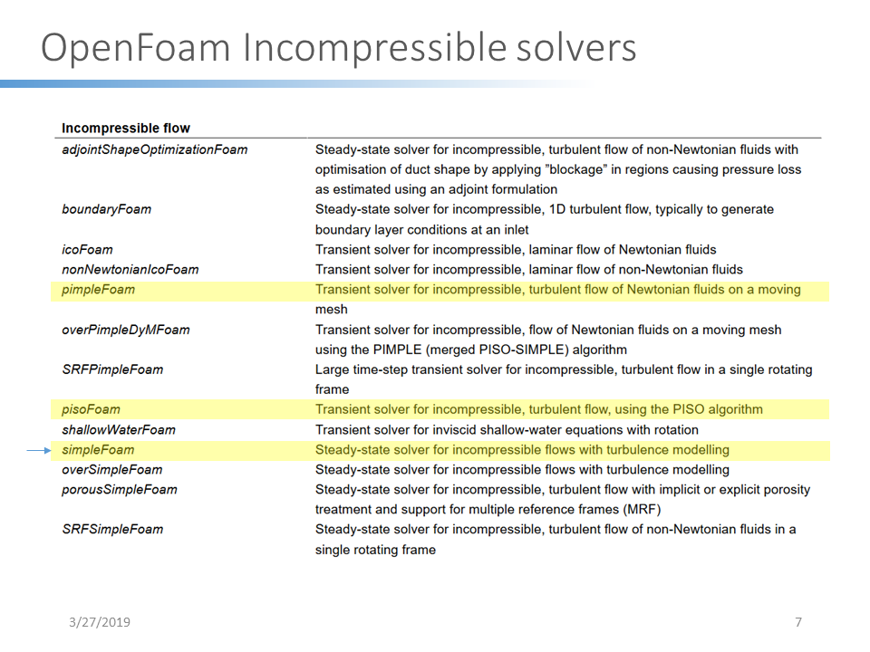
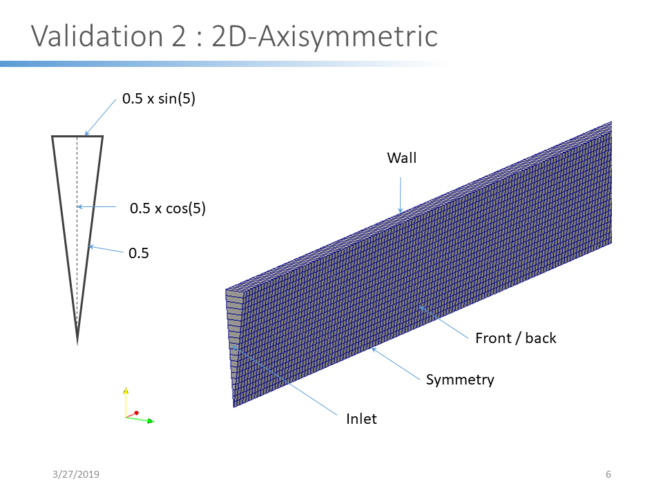
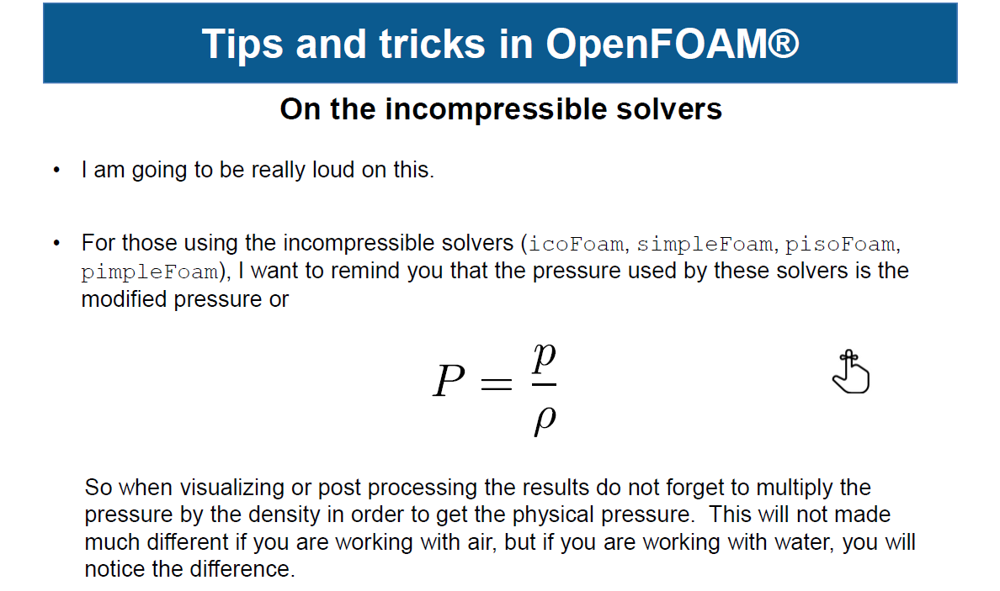
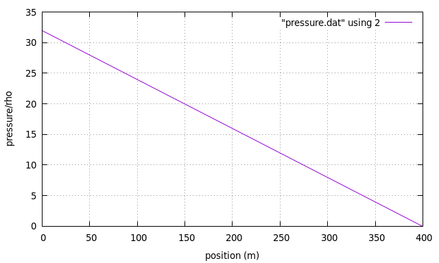
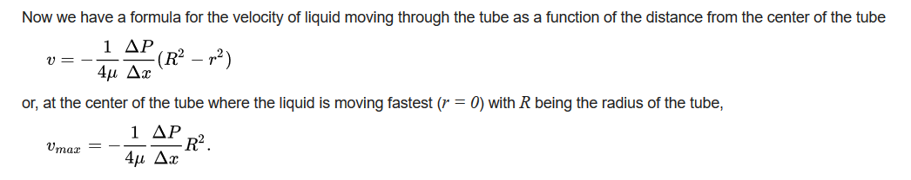
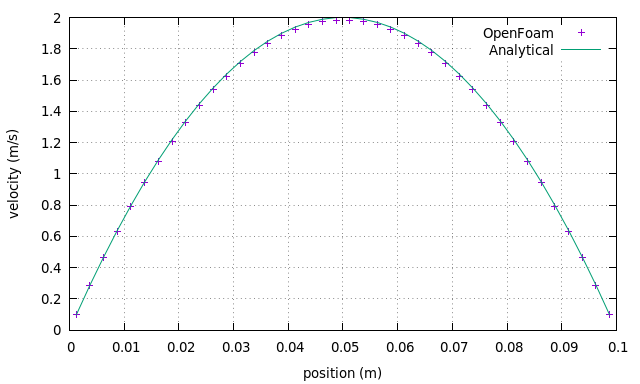
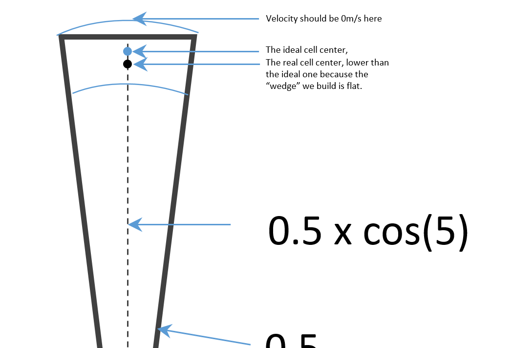

## Laminar flow in a 2D axis-symmetric channel

There are several solvers available for incompressible flow. See the table below :

icoFoam is argubaly the simplest solver to use since it require the least parameters, no turbulence required. Therefore, we use icoFoam in this first validation case.

### Mesh setup 

A 10 degree wedge shape model was made to represent the 2D axis-symmetric channel. The lenght of the channel is 1m and the diameter is 0.1m. (So the radius being 0.05m) In the blockMeshDict file, however, one have to give the calculated vertex position based on the 5 degree.
```
vertices
(
    (0 0 0)
    (10 0 0)
    (10 0.49809734 0.04357787)
    (0 0.49809734 0.04357787)
    (0 0.49809734 -0.04357787)
    (10 0.49809734 -0.04357787)
);

blocks
(
    hex (0 4 3 0 1 5 2 1) (20 1 400) simpleGrading (1 1 1)
);
```



### Boundary condition

There are two sets of boundary conditions in OpenFoam, base type and primitive type. Base type, including patch, wall and others, is applied in ./constant/polymesh/boundary. Primitive type, including specific numerical condition, for example zeroGradient, is applied in ./0/U,p...

In this case, the base type and primitive type boundary conditions are applied as follows:

- base type; implemented in blockMeshdict
```
boundary
(
    Inlet
    {
        type patch;
        faces
        (
            (0 3 4 0)
        );
    }
    Outlet
    {
        type patch;
        faces
        (
            (1 5 2 1)
        );
    }
    fixedWall
    {
        type wall;
        faces
        (
            (3 2 5 4)
        );
    }
    front
    {
        type wedge;
       faces
         (
             (0 1 2 3)
         );
    }
    back
    {
        type wedge;
       faces
         (
             (0 4 5 1)
         );
    }
    axis
         {
            type symmetry;
            faces
              (
                  (0 1 1 0)
              );

         }

);
```

- And primitive type, implemented in 0/U and 0/p:
Notice the pressure inlet was implemented to have a fixed gradient, and the pressure outlet is fixed value.
```
# 0/p
boundaryField
{
    Inlet
    {
        type            fixedGradient;
        gradient        uniform 32;
    }
    Outlet
    {
        type            fixedValue;
        value           $internalField;
    }

    fixedWall
    {
        type            zeroGradient;
    }
    front
    {
        type            wedge;
    }
    back
    {
        type            wedge;
    }
    axis
    {
        type            symmetry;
    }
}
```

And the velocity inlet and outlet are both "free".
```
# 0/U
boundaryField
{
    Inlet
    {
        type            zeroGradient;
    }
    Outlet
    {
       type             zeroGradient;
    }

    fixedWall
    {
        type            noSlip;
    }
    front
    {
        type            wedge;
    }
    back
    {
        type            wedge;
    }
    axis
    {
        type            symmetry;
    }
}
```

### Fluid properties

For incompressible fluid, the properties appeared in N-S equations should be density and viscosity. However, in OpenFoam, those 2 are combined to a kinematic viscosity, which is viscosity/rho, and it's defined in consant/tranportproperties file:
```
// * * * * * * * * * * * * * * * * * * * * * * * * * * * * * * * * * * * * * //

nu              [0 2 -1 0 0 0 0] 0.01;


// ************************************************************************* //
```
Be careful, that it means the pressure in the result should be multiplied by the rho. This problem has been pointed out explicitly by Wolfdynamics:


Remember we have specified the channel length to be 1m, the true pressure gradient should be 32 times the rho.

### Results and discussion

First, we want to investigate the pressure field, to see if it's strictly with a gradient of 32 pa/m.



And we see the pressure in the first cell is 31.96 and the last cell 0.04, considering that the number is sampled at the center of the cell, we confirmed that the pressure drop is EXACTLY 32 (because we have 400 cells on the length direction, 32/400 = 0.08).

According to Hagen-Poiseuille equation, the velocity profile and maximum velocity of laminar flow in a round channel should be:



In our case, the viscosity is 0.01/rho, and the pressure is also modified to p/rho, so as a result those two rho's canceled each other. The maximum velocity should be 1/(4*0.01) x 32 x 0.05^2 = 2 m/s.



As shown in the graph above, the max velocity from the calculation was about 1.98073 m/s, which is about 2% less than the analytical solution. This doesn't mean, however, we had 2% error in our calculation. To explain the reason of this difference, we need to carefully investigate the geometry of our model and think about the definition of velocity profile.



As we see in the picture above, the actual cell center is lower than the ideal geometry center of the cell. We can calculate :  
- The ideal radius of the channel : 0.05
- The actual radius of the channel : 0.05 * cos(5) = 0.0498
- The y of ideal center : 0.4875
- The y of actual center : 0.4856

Return to the equation of Hagen-Poiseuille flow, we can calculate the velocity at the cell closest to the center will be 1.983 m/s, while our result shows 1.9807 m/s so the difference is about 0.3%. Also we can expect that there will be difference due to the imperfect shape of our wedge model so the difference is very acceptable.

To reduce this difference, we can try to reduce the angle of our wedge model, and I have confirmed the numerical and analytical result will converge together.
