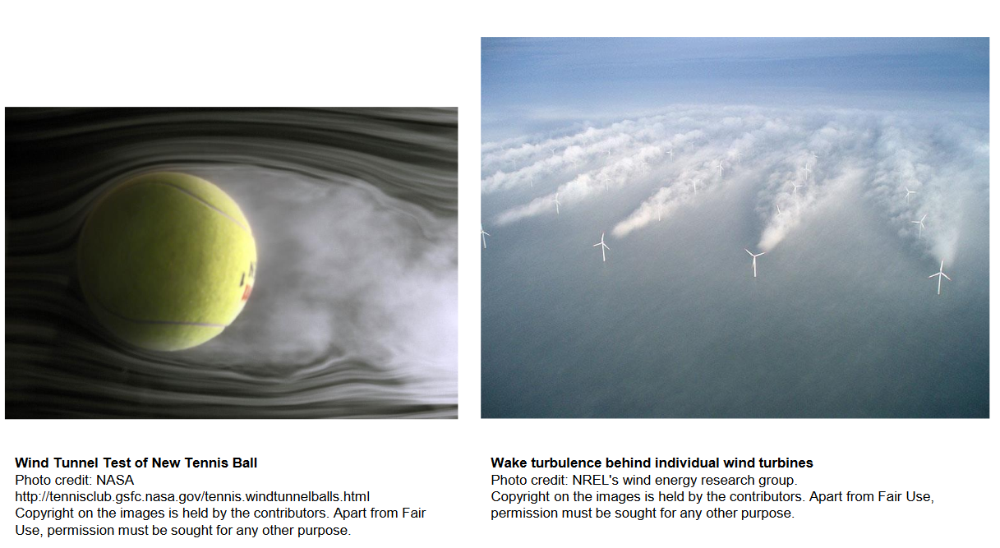
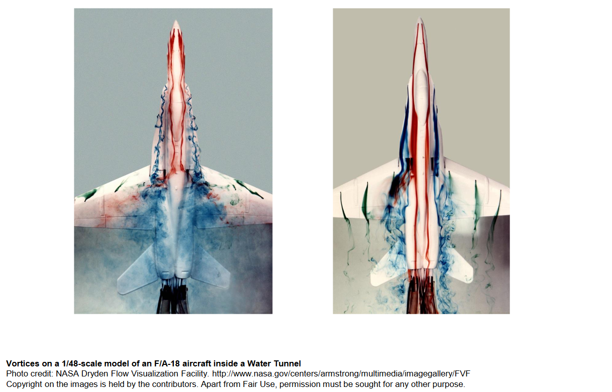
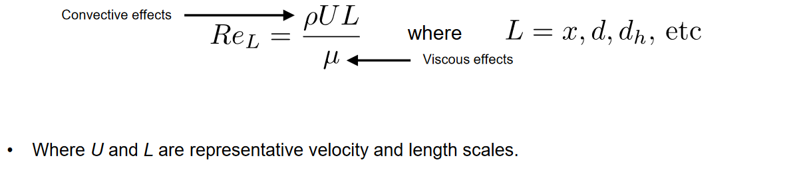
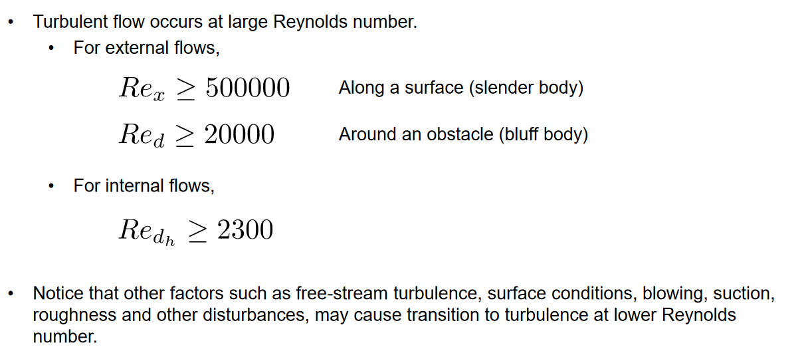
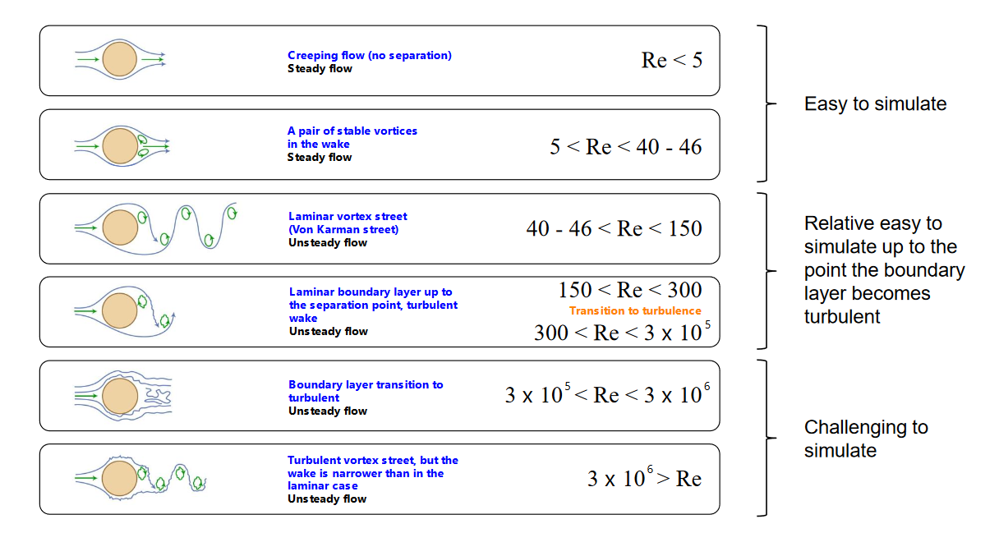

## Turbulent flow in a 2D axis-symmetric channel

### Theory : What is Turbulence?

> The originial tutorial from [Wolfdynamics](http://www.wolfdynamics.com/images/pdf/turbulence_2019.pdf).

- Definition of turbulence is a very challenging issue due to its extremely complex nature and incomplete understanding of its theory. 
- Turbulence. Does it matter?
    - Usually the existence of turbulence enhances heat transfer, and lower the flow resistance (because the existence of many small vortexes in the flow region).   

### Modeling turbulence
- The goal of turbulence modeling is to develop equations that predict **the time averaged** velocity, pressure, temperature fields without calculating the complete turbulent flow pattern as a function of time.
- There is **no universal turbulence model,** hence you need to know the capabilities and limitations of the turbulence models.
- Before doing a simulation or experiment, check if the flow is turbulent : 

- The boundary of Reynolds number between laminar and turbulence is roughly several thousands.

- It's impractical to simulate all the fluctuation in the flow, thus we need modeling. To remove the instantaneous fluctuations or small scales, two methods can be used: Reynolds averaging and Filtering.

- Grid requirement : DNS > LES > RAS(RANS)
